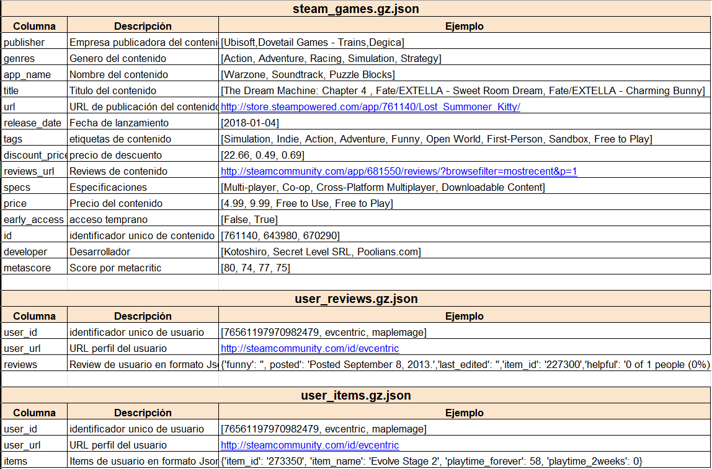

<h1 align='center'> Proyecto Individual N°1</h1>

<h2 align='center'> Machine Learning Operations (MLOps)</h2>

<h2 align='center'>William Castro, DATAPT05</h2>

---

## **`Tabla de Contenidos`**

- [Introducción](#introducción)
- [Desarrollo](#desarrollo)
    - [ETL - EDA](#ETL-EDA)
    - [Sistema de recomendación](#modelo-de-recomendación)
    - [Despliegue de la API](#despliegue-para-la-api)
- [Contacto](#contacto)

- ## **`Links`**
    - [Carpeta con los dataset](./datasets/)
    - [Proceso de ETL, EDA, Modelo de recomendaciones](./scrits/)
    - [API desplegada en Render](https://steam-game-mlops.onrender.com/docs)
    - [Link al video]()

---

# Introducción

Este proyecto se centra en Machine Learning Operations (MLOps) y se divide en tres etapas, los datos utilizados incluyen información sobre juegos en la plataforma Steam y la interacción de los usuarios con estos juegos.

1. **Exploración y Transformación:** Análisis exploratorio de los datos, incluyendo la detección de correlaciones y valores atípicos.

2. **Preparación de Datos:** Preparación de datos para comprender las relaciones entre variables y construir modelos. Creación de funciones para consultas a los datos a través de una API.

3. **Modelado:** SDesarrollo de modelos de Machine Learning para entender relaciones y predecir correlaciones entre variables.

## Diccionario de los Datos

---

# Desarrollo

### Exploración, Transformación y Carga (ETL)

Se realizaron procesos de limpieza en tres datasets proporcionados (steam_games, user_reviews y user_items) de la plataforma Steam.

#### `steam_games`

Limpieza de filas nulas y duplicados en el ID.
Completado de valores nulos en géneros a partir de datos de tags.
Normalización de la columna de precios y eliminación de valores nulos.
Extracción de años de la columna release_date.
Eliminación de columnas no utilizadas.
Exportación del dataset en csv.

#### `user_reviews`

Explode de la columna de reviews.
Eliminación de filas con valores nulos.
Creación de una nueva columna 'sentiment_analysis' mediante análisis de sentimiento.
Exportación del dataset en csv.gz.

#### `user_items`

Explode de la columna de items.
Eliminación de filas con valores nulos.
Eliminación de columnas no utilizadas.
Exportación del dataset limpio.

### Análisis Exploratorio (EDA)

Se realizó un análisis exploratorio de los datasets para entender las estadísticas, identificar valores atípicos y orientar el análisis futuro.

Análisis total videojuegos por genero
Análisis total lanzamientos por año
Análisis lanzamientos en los ultimos 10 años por genero
Análisis horas jugadas por genero
Analisis de la correlacion entre horas jugadas y cantidad de lanzamientos
Análisis 10 juegos mas jugados
Análisis Publisher Top 10 mas jugados
Análisis de outlier en la columna playtime_forever
Análisis de price en la columna playtime_forever
Analisis de la correlacion entre horas jugadas y el precio de los videojuegos
Analisis de videojuegos mas jugados y videojuegos mas costosos

### Modelo de Recomendación

#### `Modelo relación ítem-ítem`
 Se utiliza la técnica de similitud del coseno con cosine_similarity para encontrar juegos similares al producto ingresado. Se verifica si el id_producto está en el conjunto de datos y se calcula la similitud con todos los otros juegos. Luego, se ordenan los juegos según su similitud y se eligen los 5 más similares.
#### `Modelo relación user-ítem`

Se utiliza un modelo previamente entrenado (SVD) para recomendar 5 juegos no valorados por un usuario específico. Primero, verifica si el id_usuario está en el conjunto de datos. Luego, calcula las predicciones para los juegos no valorados por el usuario y los ordena según la calificación predicha. Finalmente, selecciona los títulos de los juegos recomendados que existen en el conjunto de datos y los devuelve como una lista.

### Despliegue para la API

Desarrollo de funciones para ser consumidas a través de la API en la página Render:

- **`PlayTimeGenre(genero:str)`**:Esta función debe devolver año con mas horas jugadas para dicho género.
    Ejemplo de retorno: {"Año de lanzamiento con más horas jugadas para Género X" : 2013}
- **`UserForGenre(genero:str)`**:Esta función devolver el usuario que acumula más horas jugadas para el género dado y una 
    lista de la acumulación de horas jugadas por año.Ejemplo de retorno: {"Usuario con más horas jugadas para Género X"    :us213ndjss09sdf, "Horas jugadas":[{Año: 2013, Horas: 203}, {Año: 2012, Horas: 100}, {Año: 2011, Horas: 23}]}
- **`UsersRecommend(year:int)`**:Esta función el top 3 de juegos MÁS recomendados por usuarios para el año dado. (reviews.
    recommend = True y comentarios positivos/neutrales) Ejemplo de retorno: [{"Puesto 1" : X}, {"Puesto 2" : Y},{"Puesto 3" : Z}]'
- **`UsersNotRecommend(year:int)`**: Esta función el top 3 de juegos MENOS recomendados por usuarios para el año dado. (reviews.
    recommend = False y comentarios negativos) Ejemplo de retorno: [{"Puesto 1" : X}, {"Puesto 2" : Y},{"Puesto 3" : Z}]
- **`sentiment_analys(year:int)`**:Esta funcion según el año de lanzamiento, se devuelve una lista con la cantidad de 
    registros de reseñas de usuarios que se encuentren categorizados con un análisis de 
    sentimiento. Ejemplo de retorno: {Negative = 182, Neutral = 120, Positive = 278}
- **`recomendacion_juego(id_producto:int)`**:Ingresando el id de producto, deberíamos recibir una lista con 5 juegos recomendados 
    similares al ingresado.
- **`usuario(id_usuario:str)`**:Ingresando el id de un usuario, deberíamos recibir una lista con 5 juegos recomendados para dicho 
    usuario.

## Contacto

  
  

